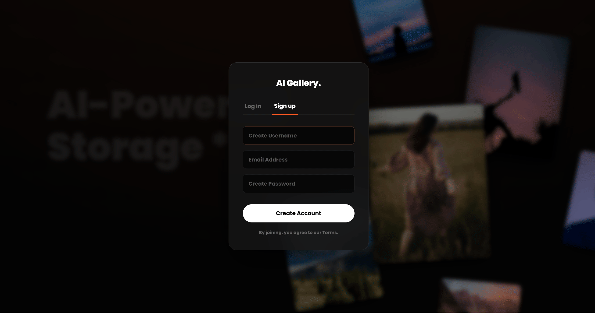

# 📸 AI Gallery - Intelligent Asset Manager


## 📖 项目介绍 (Introduction)

**AI Gallery** 是一个基于 B/S 架构的现代化智能图片管理平台。针对传统本地图片存储检索难、管理乱的痛点，本项目利用 Web 技术实现了图片的云端存储、智能分类与多端访问。

系统不仅支持基础的图片上传、EXIF 信息提取、在线编辑功能，还创新性地引入了 **AI 计算机视觉模型** 进行自动打标，并支持 **MCP (Model Context Protocol)** 协议，允许用户通过大语言模型（LLM）以自然语言对话的方式检索图库内容。

## ✨ 核心功能 (Features)

本项目严格按照[课程实验要求](./docs/assignment.pdf)开发，实现了以下功能：

### 基础模块
* **🔐 用户鉴权**：完整的注册/登录流程，支持用户名/邮箱唯一性校验。
* **☁️ 多端上传**：适配 PC 与移动端浏览器，支持拖拽上传与手机相册上传。
* **🖼️ 智能展示**：支持瀑布流/网格布局，提供沉浸式轮播图 (Slideshow) 浏览体验。
* **📝 在线编辑**：内置图片编辑器，支持裁剪、旋转、色调调整等操作。
* **ℹ️ 元数据管理**：自动提取并解析 EXIF 信息（拍摄时间、地点等）。

### 🤖 AI 与智能化 (Advanced)
* **🏷️ AI 自动打标**：集成计算机视觉模型，上传时自动识别内容（如“风景”、“猫”、“建筑”）并添加标签。
* **💬 MCP 语义检索**：实现了 Model Context Protocol 接口，支持通过 LLM 进行语义化搜图。

## 🛠 技术栈 (Tech Stack)

| 领域 | 技术选型 | 关键说明 |
| :--- | :--- | :--- |
| **Frontend** | React 18 + Vite 5 | 高性能现代化构建 |
| **UI Framework** | Ant Design 5 | 响应式设计 (Responsive)，适配多端 |
| **Image Tools** | React Cropper / Exifr | 前端图片裁剪与 EXIF 预解析 |
| **Backend** | Java 21 + Spring Boot 3.5 | 采用最新 JDK LTS 版本 |
| **Security** | Spring Security + JWT | 无状态认证鉴权 |
| **AI Integration** | Baidu AIP + DashScope SDK | 集成百度/阿里通义千问大模型能力 |
| **Data & ORM** | MySQL 8.0 + MyBatis-Plus | 数据持久化与高效 ORM |
| **Deployment** | Docker + Nginx | 前后端分离容器化部署 |

## 📸 界面预览 (Screenshots)

<div align="center">
  <table style="border: none">
    <tr>
      <td width="50%" align="center">
        <br>
        <b>沉浸式欢迎页</b>
      </td>
      <td width="50%" align="center">
        <br>
        <b>智能主控台</b>
      </td>
    </tr>
    <tr>
      <td align="center">
        <br>
        <b>毛玻璃登录</b>
      </td>
      <td align="center">
        <br>
        <b>3D 流体视图</b>
      </td>
    </tr>
    <tr>
      <td align="center">
        <br>
        <b>在线专业编辑</b>
      </td>
      <td align="center">
        <br>
        <b>MCP 自然语言检索</b>
      </td>
    </tr>
  </table>
</div>

## 🚀 快速开始 (Getting Started)

本项目支持 **Docker 一键启动**

### 📂 测试素材 (Sample Data)
为了方便您快速体验功能，我们在项目根目录的 **`sample_images/`** 文件夹中准备了多张测试图片（包含风景、人像及带有完整 EXIF 信息的原图）。您可以在上传界面直接使用这些图片进行测试。

### Docker 一键部署 

确保本地已安装 [Docker](https://www.docker.com/) 和 Docker Compose。

```bash
# 1. 克隆仓库
git clone https://github.com/Aubrey-Alex/AI-Gallery.git
cd AI-Gallery

# 2. 启动服务 (自动构建镜像并初始化数据库)
docker-compose up -d

# 3. 访问项目
# 前端地址: http://localhost
# 后端接口: http://localhost:8080
# 数据库管理: 端口 3306 (账号: ai_admin / 密码: 123456)
```

> **注意**：首次启动时 MySQL 会自动执行 `database/` 目录下的 SQL 脚本进行初始化，请耐心等待 1-2 分钟。

## 📂 目录结构 (Structure)

```text
AI-Gallery/
├── backend/                # Spring Boot 后端源码
├── frontend/               # React 前端源码
├── database/               # SQL 初始化脚本
├── sample_images/          # ⭐ 测试用图片素材 (方便快速体验)
├── docs/                   # 文档目录
├── docker-compose.yml      # 容器编排配置
└── README.md               # 项目说明
```

---
*Powered by Spring Boot & React*